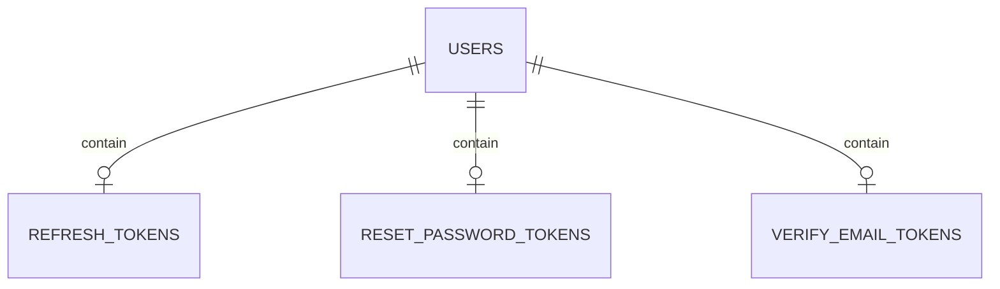

# About

NodeJS project for user account verification

# entity relationship diagram:



# Executing the Project

To run the project, use the following command:

```javascript

    npm run dev
```

# dependencies

-   [Prisma](https://www.prisma.io/)
-   [JWT](https://jwt.io)
-   [BCrypt](https://www.npmjs.com/package/bcrypt)
-   [JsonWebToken](https://www.npmjs.com/package/jsonwebtoken)
-   [tsyringe](https://www.npmjs.com/package/tsyringe)
-   [Celebrate](https://www.npmjs.com/package/celebrate)
-   [DayJs](https://www.npmjs.com/package/dayjs)
-   [Handlebars](https://www.npmjs.com/package/handlebars)
-   [nodemailer](https://www.npmjs.com/package/nodemailer)

# resources

-   create user
-   authentication
-   verify account
-   Refresh token
-   reset password
-   send forgot password

<h3 align="center">created by  Delano Almeida filho </h3>
